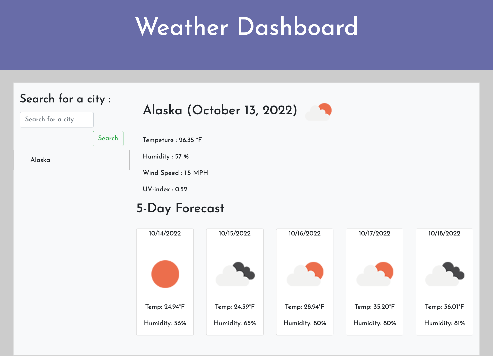

# Server-APIS-Weather-Dashboard
 
## Description

- My motivation for this project was to apply the skills, knowledge, and tools learned on class related to HTML, CSS, but specially the ones related to server side APIs and their usage.
- I built this project with the intention of putting in practice my ability to use Server side APIs to grab data and use it to my advantage for the creation of webpages.
- The code was created to show some HTML, proper CSS styling elements, and usage of Server side APIs
- I learned how to properly use Server side APIs to grab external data and display it however i want in a webpage

## Installation

N/A

## Usage
- Try it out:
https://joseobm92.github.io/Server-APIS-Weather-Dashboard/

## Credits

N/A

## License

N/A

